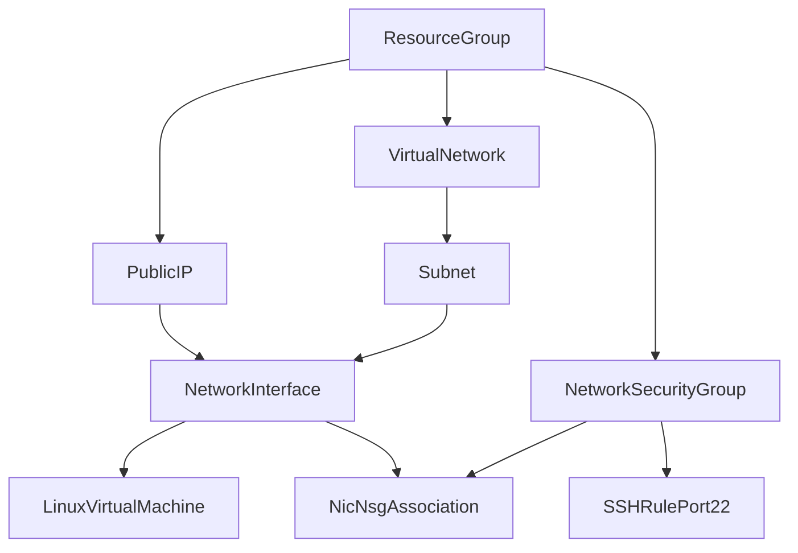

## Azure VM Terraform: Components and Flow

This README explains the Terraform components in this project, how they depend on each other, and the exact execution flow from local setup to SSH login.

## File purpose

- `versions.tf`: Terraform and provider version constraints.
- `providers.tf`: AzureRM provider configuration.
- `variables.tf`: all input variables (region, VM size, SSH, tags, network ranges).
- `main.tf`: all Azure resources and dependency graph.
- `outputs.tf`: final values after apply (public IP and SSH command).
- `terraform.tfvars.example`: template values to copy into local `terraform.tfvars`.
- `gen-ssh-key.sh`: helper to generate local SSH keypair.

## Terraform components (in dependency order)

1. `azurerm_resource_group.this`
   - Base container for all resources.

2. `azurerm_virtual_network.vm`
   - Created inside the resource group.
   - Uses `vnet_address_space`.

3. `azurerm_subnet.vm`
   - Created inside the VNet.
   - Uses `subnet_address_prefixes`.

4. `azurerm_public_ip.vm`
   - Public IPv4 address assigned to VM NIC.

5. `azurerm_network_security_group.vm`
   - Security boundary for network rules.

6. `azurerm_network_security_rule.ssh`
   - Inbound TCP 22 allow rule inside NSG.
   - Source controlled by `ssh_allowed_cidr`.

7. `azurerm_network_interface.vm`
   - NIC connected to subnet and public IP.

8. `azurerm_network_interface_security_group_association.vm`
   - Attaches NSG to NIC.

9. `azurerm_linux_virtual_machine.vm`
   - Final compute resource.
   - Uses NIC, VM size, admin username, SSH key, and image.

## Runtime interaction flow

Provisioning flow in Azure during `terraform apply`:

1. Terraform authenticates via Azure CLI session.
2. Resource group is created.
3. Network layer is created (VNet -> Subnet).
4. Security layer is created (NSG -> SSH rule).
5. Public IP is created.
6. NIC is created and wired to subnet + public IP.
7. NSG is associated to NIC.
8. VM is created using:
   - NIC id
   - selected VM size
   - Ubuntu image
   - SSH public key
9. Outputs are returned:
   - `vm_public_ip`
   - `ssh_command`

Connection flow after deploy:

1. SSH client on your laptop uses private key (`ssh_private_key_path`).
2. Traffic goes to VM public IP on port 22.
3. NSG rule permits source CIDR from `ssh_allowed_cidr`.
4. VM validates corresponding public key and grants access.

## Component dependency diagram



## Input variable flow

Where values come from (highest precedence last):

1. defaults in `variables.tf`
2. values in `terraform.tfvars`
3. CLI overrides (`-var`), if used

Key variables and what they affect:

- `location`: region for RG/network/VM.
- `vm_size`: VM SKU.
- `admin_username`: Linux login user.
- `ssh_public_key` / `ssh_public_key_path`: VM SSH auth key source.
- `ssh_allowed_cidr`: inbound SSH source filter.
- `vnet_address_space` / `subnet_address_prefixes`: network ranges.
- `tags`: applied to Azure resources.

## Local-to-cloud execution order

1. Login to Azure:
   ```bash
   az login
   az account show
   ```

2. Generate SSH keypair:
   ```bash
   ./gen-ssh-key.sh
   ```

3. Create local vars file:
   ```bash
   cp terraform.tfvars.example terraform.tfvars
   ```

4. Set actual values in `terraform.tfvars`:
   - set `ssh_public_key_path` to your `.pub` file
   - set `location`, `vm_size`, and `tags.owner`

5. Initialize provider/plugins:
   ```bash
   terraform init
   ```

6. Build dependency plan:
   ```bash
   terraform plan
   ```

7. Provision resources:
   ```bash
   terraform apply
   ```

8. Read outputs:
   ```bash
   terraform output
   ```

9. SSH to VM:
   ```bash
   ssh -i ~/.ssh/azure-dev-vm azureuser@<vm_public_ip>
   ```

## Current default configuration

- Region: `eastus2`
- VM size: `Standard_D4as_v7` (16 GB RAM)
- Image: Ubuntu 22.04 Gen2 (`0001-com-ubuntu-server-jammy`, `22_04-lts-gen2`)
- SSH source CIDR: `0.0.0.0/0`

## Cleanup flow

To remove all provisioned Azure resources managed by this configuration:

```bash
terraform destroy
```

To confirm everything is removed from managed state:

```bash
terraform plan
```

